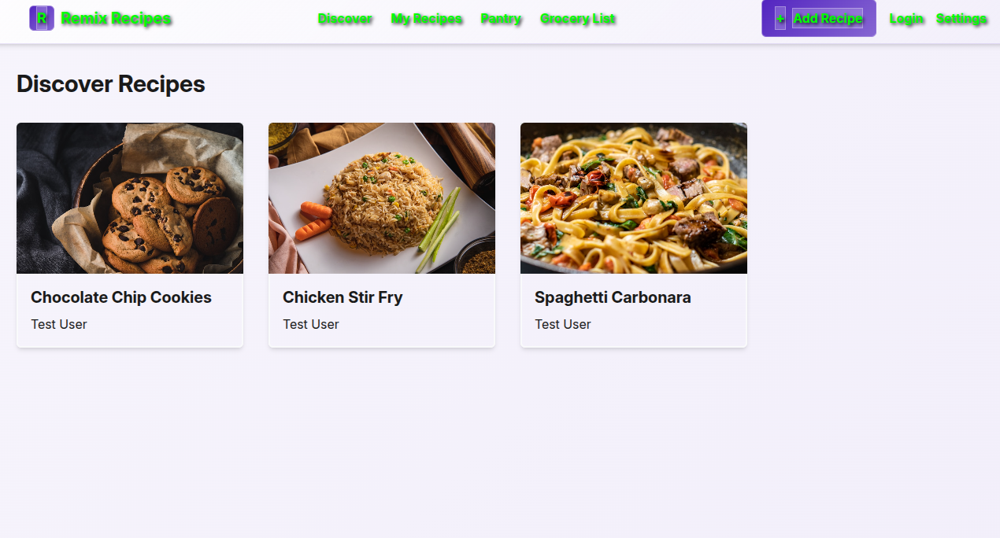

# 🍳 Remix Recipes

A full-stack recipe management application built with Remix, TypeScript, and SQLite. Organize your recipes, manage your pantry, and automatically generate shopping lists.



## ✨ Features

### 📚 Recipe Management
- **Create & Edit Recipes**: Add your favorite recipes with ingredients and instructions
- **Recipe Discovery**: Browse and discover new recipes
- **Image Upload**: Add photos to your recipes
- **Recipe Deletion**: Remove recipes you no longer need

### 🥫 Pantry Management
- **Organized Shelves**: Create custom pantry shelves (Refrigerator, Pantry, etc.)
- **Inventory Tracking**: Keep track of ingredients and quantities
- **Smart Organization**: Easily categorize and find your pantry items

### 🛒 Smart Shopping Lists
- **Auto-Generated Lists**: Automatically create shopping lists from recipes
- **Missing Ingredients**: Only adds ingredients you don't have in your pantry
- **Mark as Complete**: Check off items as you shop
- **Quick Actions**: Clear completed items or start fresh

### 📱 Mobile-First Design
- **Responsive Layout**: Works perfectly on phones, tablets, and desktop
- **Touch-Friendly**: Optimized for mobile interaction
- **Modern UI**: Clean, intuitive interface

## 🚀 Tech Stack

- **Framework**: [Remix](https://remix.run/) - Full-stack React framework
- **Language**: TypeScript
- **Database**: SQLite with Prisma ORM
- **Styling**: Tailwind CSS
- **Icons**: Custom SVG components
- **File Upload**: Recipe image storage

## 🚀 Quick Deploy

<!-- Deployment trigger comment -->

[](https://app.netlify.com/start/deploy?repository=https://github.com/MSMITH71910/remix-recipes)

## 🛠️ Local Development

1. **Clone the repository**
   ```bash
   git clone https://github.com/MSMITH71910/remix-recipes.git
   cd remix-recipes
   ```

2. **Install dependencies**
   ```bash
   npm install
   ```

3. **Set up the database**
   ```bash
   npx prisma migrate dev
   npx prisma db seed
   ```

4. **Start the development server**
   ```bash
   npm run dev
   ```

5. **Open in browser**
   ```
   http://localhost:3000
   ```

## 📖 Usage

### Getting Started
1. Visit the **Discover** page to explore sample recipes
2. Go to **My Recipes** to see your personal collection
3. Click **Add Recipe** to create your first recipe

### Managing Your Pantry
1. Navigate to the **Pantry** section
2. Add items to your refrigerator or pantry shelves
3. Keep track of quantities and expiration dates

### Creating Shopping Lists
1. Find a recipe you want to make
2. Click "Add to Shopping List" 
3. Visit **Grocery List** to see missing ingredients
4. Check off items as you shop

### Recipe Management
- **View**: Click any recipe to see full details
- **Edit**: Use the edit button to modify recipes
- **Delete**: Remove recipes with the delete button (includes confirmation)

## 🗃️ Database Schema

The application uses a SQLite database with the following main entities:

- **User**: User accounts and profiles
- **Recipe**: Recipe information, instructions, and metadata
- **Ingredient**: Recipe ingredients with amounts
- **PantryShelf**: Organized storage areas
- **PantryItem**: Items in your pantry with quantities
- **GroceryItem**: Shopping list items with completion status

## 📱 Mobile Support

This app is fully optimized for mobile devices:

- **Touch Targets**: All buttons meet 44px minimum size guidelines
- **Responsive Grid**: Adapts from 1 column (mobile) to 4 columns (desktop)
- **Mobile Navigation**: Collapsible navigation for small screens
- **Touch Gestures**: Optimized for finger interaction

## 🔧 Development

### Project Structure
```
app/
├── components/          # Reusable UI components
├── models/             # Database models and queries
├── routes/             # Remix route handlers
├── utils/              # Utility functions
└── app.css            # Global styles

prisma/
├── schema.prisma      # Database schema
└── seed.ts           # Database seeding
```

### Key Commands
```bash
npm run dev            # Start development server
npm run build          # Build for production
npm run start          # Start production server
npx prisma studio      # Open database browser
```

## 🎨 Customization

The app uses Tailwind CSS for styling. Key customizations:

- **Primary Color**: Defined in theme configuration
- **Component Styles**: Located in individual component files
- **Responsive Breakpoints**: Standard Tailwind breakpoints

## 🌐 Deployment

### Netlify (Recommended)
This app is optimized for Netlify deployment. See [DEPLOYMENT.md](DEPLOYMENT.md) for detailed instructions.

### Other Platforms
- **Vercel**: Compatible with minor configuration changes
- **Railway**: Works with the existing setup  
- **Render**: Supports Node.js applications

## 📄 License

MIT License - feel free to use this project for your own recipe management needs!

## 🤝 Contributing

This is a personal project, but suggestions and improvements are welcome!

---

**Made with ❤️ using Remix and TypeScript**